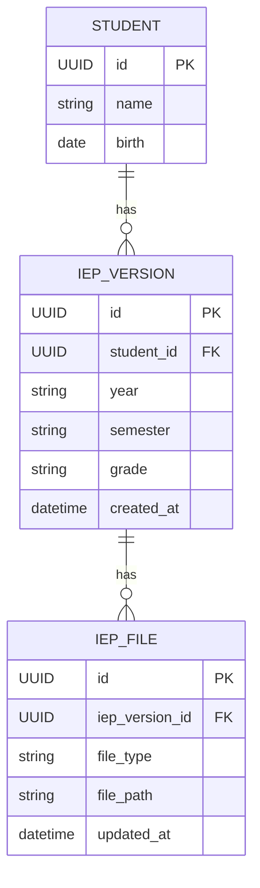

# Architecture Documentation

## 📋 개요

IEP Planning Support 백엔드의 시스템 아키텍처, 데이터 저장 패턴, AI 통합 방식, 비즈니스 규칙을 설명합니다.

**핵심 설계 원칙**: "백엔드는 박스를 관리하고 (파일/DB/API), AI는 박스를 채운다 (컨텐츠)."

---

## 📑 목차

1. [시스템 아키텍처](#시스템-아키텍처)
2. [데이터베이스 설계](#데이터베이스-설계)
3. [하이브리드 저장 아키텍처](#하이브리드-저장-아키텍처)
4. [AI 모듈 통합](#ai-모듈-통합)
5. [비즈니스 로직](#비즈니스-로직)
6. [DOCX 생성 패턴](#docx-생성-패턴)
7. [보안 및 성능](#보안-및-성능)

---

## 시스템 아키텍처

### 전체 구조

```
┌─────────────────┐
│   Frontend      │
│   (React)       │
└────────┬────────┘
         │ HTTP/REST
         ▼
┌─────────────────┐
│   FastAPI       │
│   Backend       │
├─────────────────┤
│ • API Routers   │
│ • Services      │
│ • Models        │
└────┬───────┬────┘
     │       │
     │       └──────────┐
     ▼                  ▼
┌─────────┐      ┌──────────────┐
│PostgreSQL│      │ File Storage │
│   DB     │      │  (Disk)      │
└──────────┘      └──────────────┘
     │                  │
     │                  │
     ▼                  ▼
 Metadata           JSON Content
  (경로, 타입)        (실제 데이터)
```

### 레이어 구조

```
┌─────────────────────────────────────┐
│   API Layer (FastAPI Routers)      │
│   - students.py                     │
│   - iep_versions.py                 │
│   - iep_files.py                    │
└─────────────────────────────────────┘
              ▼
┌─────────────────────────────────────┐
│   Service Layer                     │
│   - ai_integration.py               │
│   - file_storage.py                 │
│   - document_generator.py           │
│   - iep_business.py                 │
└─────────────────────────────────────┘
              ▼
┌──────────────┬──────────────────────┐
│ ORM Models   │  External AI Module  │
│ (SQLAlchemy) │  (ai_module/)        │
└──────────────┴──────────────────────┘
              ▼
┌──────────────┬──────────────────────┐
│  PostgreSQL  │   Disk Storage       │
└──────────────┴──────────────────────┘
```

---

## 데이터베이스 설계

### ERD (Entity Relationship Diagram)



### 테이블 상세 스키마

#### 1. STUDENT (학생)

| 컬럼 | 타입 | 제약 | 설명 |
|------|------|------|------|
| id | UUID | PK | 학생 고유 식별자 |
| name | String | NOT NULL | 학생 이름 |
| birth | Date | NOT NULL | 생년월일 |

**관계**: 1명의 학생 → N개의 IEP 버전

#### 2. IEP_VERSION (IEP 버전)

| 컬럼 | 타입 | 제약 | 설명 |
|------|------|------|------|
| id | UUID | PK | IEP 버전 고유 식별자 |
| student_id | UUID | FK (CASCADE) | 학생 참조 |
| year | String | NOT NULL | 학년도 (예: "2024") |
| semester | String | NOT NULL | 학기 ("1학기" or "2학기") |
| grade | String | NOT NULL | 학년 (예: "5") |
| created_at | DateTime | NOT NULL | 생성 시각 |

**관계**: 1개의 IEP 버전 → N개의 IEP 파일 (3개 필수)

**비즈니스 규칙**:
- 학기마다 새로운 IEP 버전 생성
- grade는 생성 시점의 학년 스냅샷 (변경 불가)

#### 3. IEP_FILE (IEP 파일 메타데이터)

| 컬럼 | 타입 | 제약 | 설명 |
|------|------|------|------|
| id | UUID | PK | 파일 고유 식별자 |
| iep_version_id | UUID | FK (CASCADE) | IEP 버전 참조 |
| file_type | String | NOT NULL | 파일 타입 (goals/weekly_plan/weekly_materials) |
| file_path | String | NOT NULL | 디스크 파일 경로 |
| updated_at | DateTime | NOT NULL | 최종 수정 시각 |

**중요**: 실제 JSON 내용은 저장하지 않음 (메타데이터만)

---

## 하이브리드 저장 아키텍처

### 개념

**3-Tier 저장 전략**:
1. **데이터베이스**: 메타데이터 (경로, 타입, 시간)
2. **디스크**: JSON 컨텐츠 (실제 IEP 데이터)
3. **휘발성**: 학생 프로필 (API 요청 → AI 호출 → 폐기)

### 파일 저장 경로 패턴

```
{STORAGE_PATH}/iep/{iep_version_id}/{file_type}-{timestamp}.json
```

**예시**:
```
./storage/iep/
└── 550e8400-e29b-41d4-a716-446655440000/
    ├── goals-1735210800.json
    ├── weekly_plan-1735210801.json
    └── weekly_materials-1735210802.json
```

### 3개 필수 JSON 파일

#### 1. goals.json (교육 목표)

**구조**:
```json
{
  "reading": {
    "annual_goal": "5학년 수준의 문학 작품을 읽고 주제를 파악할 수 있다",
    "semester_goal": "1학기 동안 단편 동화 10편을 읽고 줄거리를 요약할 수 있다"
  },
  "writing": {
    "annual_goal": "자신의 생각과 느낌을 문장으로 표현할 수 있다",
    "semester_goal": "1학기 동안 일기를 주 3회 이상 작성할 수 있다"
  }
}
```

**특징**:
- 도메인별 연간/학기 목표
- 선택된 도메인만 포함
- 연간 목표는 1학기 → 2학기 불변 (상속)

#### 2. weekly_plan.json (주차별 학습 계획)

**구조**:
```json
{
  "reading": [
    {
      "week": 1,
      "content": "동화책 '어린 왕자' 1-2장 읽기"
    },
    {
      "week": 2,
      "content": "동화책 '어린 왕자' 3-4장 읽고 줄거리 정리"
    }
    // ... 총 20주
  ]
}
```

**특징**:
- 20주 고정 (학기당)
- 도메인별 배열
- 주차별 학습 내용 텍스트

#### 3. weekly_materials.json (주차별 학습 자료)

**구조**:
```json
{
  "reading": [
    {
      "week": 1,
      "materials": [
        {
          "title": "어린 왕자 읽기 자료",
          "url": "https://edunet.net/resources/12345",
          "keywords": "문학, 동화",
          "file_type": "pdf"
        }
      ]
    }
  ]
}
```

**특징**:
- Edunet URL 참조만 (파일 다운로드 없음)
- 주차별 자료 메타데이터
- 복수 자료 가능

### 데이터 흐름도

```
[Frontend Input]
     ↓
[Student Profile] (20 fields, volatile)
     ↓
[AI Module] (3 functions)
     ├─→ generate_goals()
     ├─→ generate_weekly_plan()
     └─→ generate_weekly_materials()
     ↓
[3 JSON Objects]
     ↓
[Disk Write] → /storage/iep/{id}/*.json
     ↓
[DB Write] → iep_file (metadata only)
```

### 파일 업데이트 패턴

**덮어쓰기 규칙**:
```python
# 같은 iep_version_id + 같은 file_type
→ 기존 파일 덮어쓰기
→ file_path 갱신
→ updated_at 갱신

# 새로운 file_type
→ 새 파일 생성
→ 새 레코드 추가
```

**구현**:
```python
# services/iep_business.py
def save_or_update_iep_file(
    db, iep_version_id, file_type, content
):
    existing = db.query(IEPFile).filter(
        IEPFile.iep_version_id == iep_version_id,
        IEPFile.file_type == file_type
    ).first()
    
    file_path = save_json_file(iep_version_id, file_type, content)
    
    if existing:
        existing.file_path = file_path
        existing.updated_at = datetime.now()
    else:
        new_file = IEPFile(
            iep_version_id=iep_version_id,
            file_type=file_type,
            file_path=file_path
        )
        db.add(new_file)
    
    db.commit()
```

---

## AI 모듈 통합

### 아키텍처 원칙

**책임 분리**:
- **백엔드**: 인프라 관리 (DB, 파일, API)
- **AI 모듈**: 지능 로직 (LLM, 프롬프트, Edunet API)

**통합 방식**:
- ✅ 로컬 import (`from ai_module import ...`)
- ❌ HTTP API 호출
- ❌ 외부 서비스 직접 호출

### 3-Function 인터페이스

```python
# ai_module/generators.py

def generate_goals(student_profile: dict) -> dict:
    """
    연간/학기 목표 생성
    
    Args:
        student_profile: 20개 필드 딕셔너리
    
    Returns:
        도메인별 목표 JSON
        {
            "domain": {
                "annual_goal": "...",
                "semester_goal": "..."
            }
        }
    """
    pass

def generate_weekly_plan(student_profile: dict) -> dict:
    """
    주차별 학습 계획 생성 (20주)
    
    Returns:
        도메인별 주차 배열
        {
            "domain": [
                {"week": 1, "content": "..."},
                ...
            ]
        }
    """
    pass

def generate_weekly_materials(student_profile: dict) -> dict:
    """
    주차별 학습 자료 추천 (Edunet URL)
    
    Returns:
        도메인별 자료 배열
        {
            "domain": [
                {
                    "week": 1,
                    "materials": [...]
                }
            ]
        }
    """
    pass
```

### 학생 프로필 (20개 필드)

**휘발성 데이터** - DB/파일에 저장하지 않음

```json
{
  "name": "홍길동",
  "birth": "2010-03-15",
  "grade": 5,
  "current_semester": 1,
  "start_date": "2024-03-01",
  "end_date": "2024-07-20",
  "guardian_opinion": "학습 의욕이 높으나 집중력이 부족함",
  "cognitive_level": "평균 수준",
  "social_psych_level": "또래 관계 양호",
  "motor_daily_level": "정상 발달",
  "vci_score": 95,
  "visual_spatial_score": 92,
  "fri_score": 88,
  "wmi_score": 90,
  "psi_score": 85,
  "fsiq_score": 90,
  "korean_performance_level": "학년 수준의 80% 달성",
  "math_performance_level": "학년 수준의 75% 달성",
  "korean_domain": ["reading", "writing"],
  "math_domain": ["numbersOperations", "geometryMeasurement"]
}
```

### 도메인 선택 기반 출력

**국어 도메인** (1-6개 선택):
- `listeningSpeaking`: 듣기말하기
- `reading`: 읽기
- `writing`: 쓰기
- `grammar`: 문법
- `literature`: 문학
- `mediaLiteracy`: 매체

**수학 도메인** (1-4개 선택):
- `numbersOperations`: 수와 연산
- `changeAndRelations`: 변화와 관계
- `geometryMeasurement`: 도형과 측정
- `dataAndProbability`: 자료와 가능성

**중요**: AI 모듈은 선택된 도메인만 JSON에 포함

---

## 비즈니스 로직

### 1. 연간 목표 불변 규칙

**규칙**: 1학기와 2학기의 연간 목표는 무조건 동일

**구현 흐름**:
```
2학기 IEP 생성 요청
    ↓
1학기 IEP 존재 확인
    ↓
1학기 goals.json 로드
    ↓
연간 목표 추출 (annual_*_goal)
    ↓
AI 모듈 호출 (2학기 목표 생성)
    ↓
AI 응답의 연간 목표를 1학기 목표로 덮어쓰기
    ↓
파일 저장
```

**코드 예시**:
```python
# services/iep_business.py

def get_annual_goals_from_semester1(
    student_id: UUID,
    year: str,
    grade: str,
    db: Session
) -> Optional[Dict[str, str]]:
    """1학기 연간 목표 추출"""
    semester1_version = db.query(IEPVersion).filter(
        IEPVersion.student_id == student_id,
        IEPVersion.year == year,
        IEPVersion.grade == grade,
        IEPVersion.semester == "1학기"
    ).first()
    
    if not semester1_version:
        return None
    
    goals_file = db.query(IEPFile).filter(
        IEPFile.iep_version_id == semester1_version.id,
        IEPFile.file_type == "goals"
    ).first()
    
    if not goals_file:
        return None
    
    goals_content = load_json_file(goals_file.file_path)
    
    # Extract annual goals only
    annual_goals = {}
    for domain, goal_data in goals_content.items():
        if isinstance(goal_data, dict) and "annual_goal" in goal_data:
            annual_goals[domain] = goal_data["annual_goal"]
    
    return annual_goals if annual_goals else None
```

### 2. 파일 덮어쓰기 로직

**규칙**:
- 같은 `iep_version_id` + 같은 `file_type` → 덮어쓰기
- 다른 `file_type` → 새 파일 생성

**이유**: 사용자가 IEP를 수정할 때마다 새 버전이 아닌 현재 버전 업데이트

### 3. IEP 완료 검증

**규칙**: 3개 파일 모두 존재해야 완료

```python
def verify_iep_complete(
    iep_version_id: UUID,
    db: Session
) -> Tuple[bool, str]:
    """IEP 완료 검증"""
    required_types = {"goals", "weekly_plan", "weekly_materials"}
    
    files = db.query(IEPFile).filter(
        IEPFile.iep_version_id == iep_version_id
    ).all()
    
    existing_types = {file.file_type for file in files}
    missing_types = required_types - existing_types
    
    if missing_types:
        return False, f"Missing files: {', '.join(missing_types)}"
    
    return True, "IEP complete"
```

### 4. Grade 스냅샷

**개념**: IEP 생성 시점의 학년을 기록하고 변경하지 않음

**이유**: 
- 학생이 학년이 올라가도 과거 IEP는 당시 학년 유지
- 연간 목표 상속 시 같은 학년 기준으로 검색

---

## DOCX 생성 패턴

### 처리 흐름

```
GET /iep-versions/{id}/docx
    ↓
IEP 버전 존재 확인
    ↓
3개 JSON 파일 경로 조회 (DB)
    ↓
파일 내용 로드 (Disk)
    ↓
python-docx로 문서 생성
    ↓
StreamingResponse로 다운로드
```

### 문서 구조

```
개별화교육계획(IEP)
├─ 1. 교육 목표
│  ├─ [읽기]
│  │  ├─ 연간 목표: ...
│  │  └─ 학기 목표: ...
│  └─ [쓰기]
│     ├─ 연간 목표: ...
│     └─ 학기 목표: ...
├─ 2. 주차별 학습 계획 (20주)
│  ├─ [읽기]
│  │  └─ 표: 주차 | 학습 내용
│  └─ [쓰기]
│     └─ 표: 주차 | 학습 내용
└─ 3. 주차별 학습 자료
   ├─ [읽기]
   │  └─ 1주: URL
   └─ [쓰기]
      └─ 1주: URL
```

### 구현 예시

```python
# services/document_generator.py

def generate_iep_docx(
    iep_version_id: UUID,
    db: Session
) -> io.BytesIO:
    """IEP DOCX 생성"""
    
    # 1. 데이터 로드
    data = load_iep_data(iep_version_id, db)
    iep_version = data["iep_version"]
    goals = data["goals"]
    weekly_plan = data["weekly_plan"]
    weekly_materials = data["weekly_materials"]
    
    # 2. 문서 생성
    doc = Document()
    
    # 제목
    title = doc.add_heading(
        f"개별화교육계획(IEP) - {iep_version.grade}학년 {iep_version.semester}",
        level=1
    )
    title.alignment = 1  # Center
    
    # 교육 목표 섹션
    doc.add_heading("1. 교육 목표", level=2)
    for domain, goal_data in goals.items():
        doc.add_heading(f"[{domain}]", level=3)
        doc.add_paragraph(f"연간 목표: {goal_data['annual_goal']}")
        doc.add_paragraph(f"학기 목표: {goal_data['semester_goal']}")
    
    # 주차별 계획 섹션
    doc.add_heading("2. 주차별 학습 계획 (20주)", level=2)
    for domain, weeks in weekly_plan.items():
        doc.add_heading(f"[{domain}]", level=3)
        
        table = doc.add_table(rows=1, cols=2)
        table.style = 'Light Grid Accent 1'
        
        hdr_cells = table.rows[0].cells
        hdr_cells[0].text = '주차'
        hdr_cells[1].text = '학습 내용'
        
        for week_data in weeks:
            row_cells = table.add_row().cells
            row_cells[0].text = f"{week_data['week']}주"
            row_cells[1].text = week_data['content']
    
    # BytesIO로 저장
    file_stream = io.BytesIO()
    doc.save(file_stream)
    file_stream.seek(0)
    
    return file_stream
```

### 캐싱 전략 (선택적)

**현재**: 요청마다 동적 생성 (추천)

**향후 개선**:
- Redis 캐싱 (파일 경로 해시 → DOCX 바이너리)
- TTL: 24시간
- 파일 업데이트 시 캐시 무효화

---

## 보안 및 성능

### 보안

#### 1. 파일 접근 제어

**현재**: 파일 시스템 직접 접근 (제한 없음)

**권장 개선**:
```python
def validate_file_access(file_path: str, user_id: UUID) -> bool:
    """파일 접근 권한 검증"""
    # file_path에서 iep_version_id 추출
    # iep_version → student_id 확인
    # user_id가 해당 student 소유자인지 확인
    pass
```

#### 2. SQL Injection 방지

**SQLAlchemy ORM 사용** → 자동 방어
- Raw SQL 쿼리 사용 금지
- Parameterized 쿼리 자동 처리

#### 3. 환경 변수 관리

**민감 정보 보호**:
```bash
# .env (Git 제외)
DB_PASSWORD=<실제_비밀번호>
AI_API_KEY=<실제_API_키>

# .env.example (Git 포함)
DB_PASSWORD=your_password_here
AI_API_KEY=your_api_key_here
```

### 성능

#### 1. 데이터베이스 인덱스

```sql
-- 권장 인덱스
CREATE INDEX idx_iep_version_student ON iep_version(student_id);
CREATE INDEX idx_iep_version_created ON iep_version(created_at DESC);
CREATE INDEX idx_iep_file_version ON iep_file(iep_version_id);
CREATE INDEX idx_iep_file_type ON iep_file(file_type);
```

#### 2. 파일 I/O 최적화

**현재**: 동기 I/O

**향후 개선**:
```python
import aiofiles

async def load_json_file_async(file_path: str) -> dict:
    async with aiofiles.open(file_path, 'r') as f:
        content = await f.read()
        return json.loads(content)
```

#### 3. API 응답 최적화

**Pagination** (학생/IEP 목록):
```python
@router.get("/students")
def list_students(
    skip: int = 0,
    limit: int = 100,
    db: Session = Depends(get_db)
):
    students = db.query(Student).offset(skip).limit(limit).all()
    return students
```

#### 4. 연결 풀링

```python
# db/session.py
engine = create_engine(
    settings.sqlalchemy_database_uri,
    pool_size=10,           # 기본 연결 수
    max_overflow=20,        # 추가 연결 수
    pool_pre_ping=True,     # 연결 검증
    pool_recycle=3600       # 1시간마다 재연결
)
```

---

## 확장 가능성

### 1. 다중 과목 지원

**현재**: 국어, 수학 (2개 고정)

**향후**:
```python
# student_profile에 subject 배열 추가
{
    "subjects": [
        {
            "name": "science",
            "domains": ["physics", "chemistry"],
            "performance_level": "상"
        }
    ]
}
```

### 2. 다중 언어 지원

```python
# i18n 추가
from app.core.i18n import get_text

doc.add_heading(get_text("iep.title", locale="ko"), level=1)
```

### 3. 실시간 협업

- WebSocket 추가 (FastAPI 지원)
- IEP 동시 편집 시 충돌 해결
- 변경 이력 추적

---

## 트러블슈팅

### 문제: 파일 경로 충돌

**증상**: 같은 timestamp로 여러 파일 생성

**해결**:
```python
import uuid

file_path = f"{file_type}-{uuid.uuid4()}.json"
```

### 문제: 대용량 파일 메모리 부족

**증상**: weekly_materials가 너무 클 때 DOCX 생성 실패

**해결**:
```python
# 스트리밍 방식으로 변경
from fastapi.responses import FileResponse

# 임시 파일로 저장 후 반환
temp_file = f"/tmp/{iep_version_id}.docx"
doc.save(temp_file)
return FileResponse(temp_file, filename="IEP.docx")
```

### 문제: DB 연결 끊김

**증상**: "connection already closed" 에러

**해결**:
```python
engine = create_engine(
    settings.sqlalchemy_database_uri,
    pool_pre_ping=True  # 연결 전 검증
)
```

---

## 추가 참고 자료

- **[API 문서](API.md)**: 엔드포인트 상세 가이드
- **[개발자 가이드](dev_guide.md)**: 개발 규칙 및 워크플로우
- **[LLM 프롬프트 사양](../references/llm_prompt_specification.md)**: AI 모듈 인터페이스
- **[ERD](../references/ERD.md)**: 데이터베이스 스키마

---

**최종 업데이트**: 2024-12-26  
**버전**: 1.0.0  
**작성자**: Backend Team

